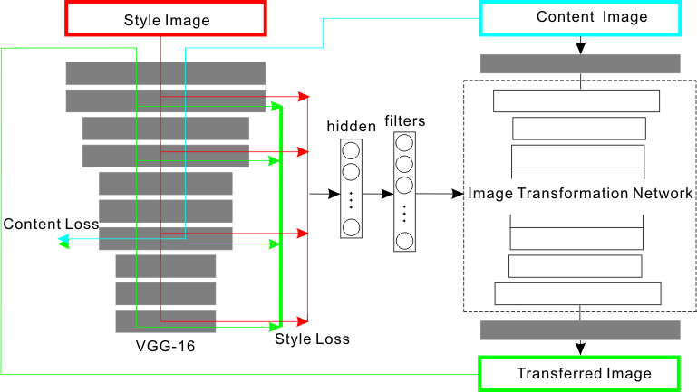
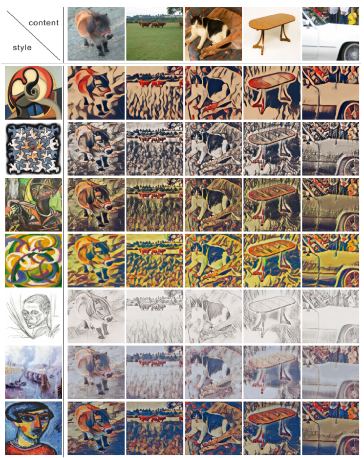
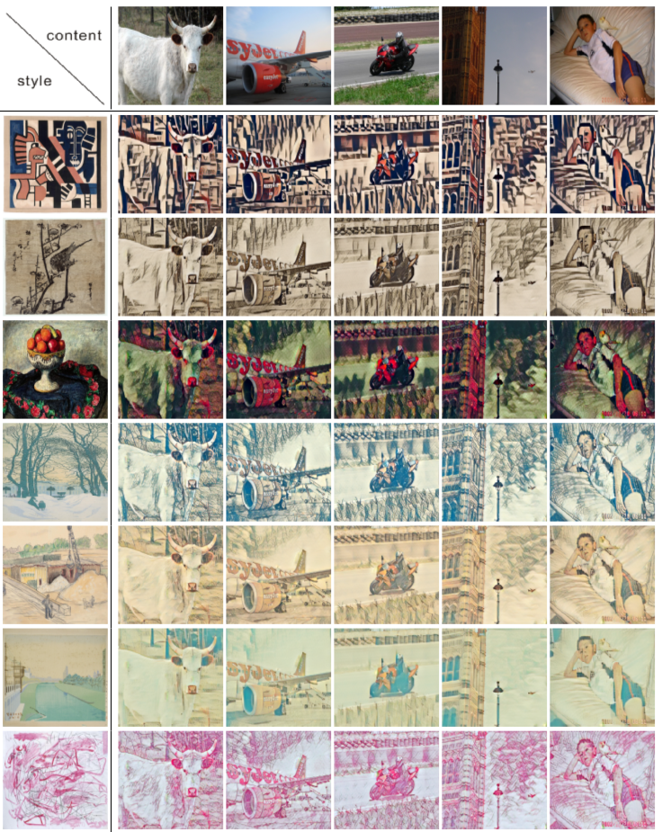

Neural Style Transfer
=====

This repository is for [Meta Networks for Neural Style Transfer](https://arxiv.org/abs/1709.04111).

    @inproceedings{shen2017style,
      author = {Falong Shen, Shuicheng Yan and Gang Zeng},
      title = {Meta Networks for Neural Style Transfer},
      booktitle = {arXiv:1709.04111},
      year = {2017}
    }

Installation
----
This library is based on [Caffe](https://github.com/BVLC/caffe). [CuDNN 7](https://developer.nvidia.com/cudnn) and [NCCL 1](https://github.com/NVIDIA/nccl) are required. Please follow
the installation instruction of [Caffe](https://github.com/BVLC/caffe).

Meta Network Architecture
----

Examples
----
The size of image transformation network for the following images is 7MB.

 

Scripts
----
Python code. Please execute the scripts in Python folder. Meta model is very huge while the generated model is very small. 

* pretrained meta models 
    [train_8 (130M), generated model is 449KB](http://pan.baidu.com/s/1bp6KGY7) 
    [train_16(298M)](http://pan.baidu.com/s/1jIrDzb4) 
    [train_32(968M),generated model is 7MB](http://pan.baidu.com/s/1pLgDU4b) 
    
Put these models into python/model/ and modify the model name in matcaffe_fcn.m.

